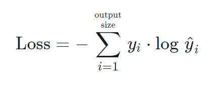
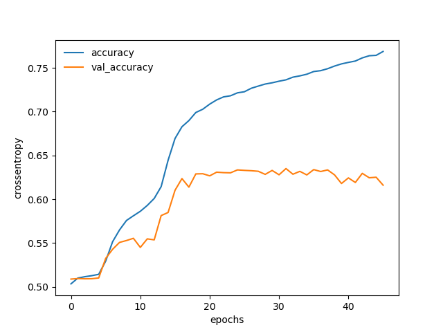
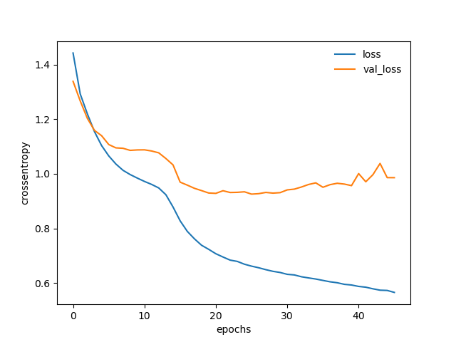

# Kaggle
Practical tutorials on Kaggle projects

<!--
# ==================================================================================================
#
#   Overview
#
# ==================================================================================================
--->

# Overview 

This repository provides some practical tutorial on Kaggle projects.

**Content:**

* [Sentiment Analysis](#Sentiment_Analysis)

<!--
# ==================================================================================================
#
#   Sentiment Analysis
#
# ==================================================================================================
--->

## Sentiment Analysis 

### Reference

You can view the details and download the dataset from [Sentiment Analysis on Movie Reviews](https://www.kaggle.com/competitions/sentiment-analysis-on-movie-reviews/data).

### Dependencies
You need to install these dependencies packages

    pip install -U numpy==1.18.5
    pip install -U tensorflow==2.3.0
    pip install -U scikit-learn==0.24.1

### Mathematical formula
Categorical cross-entropy

The y is always 0 or 1. If it is 0, the result is 0, so we just to get the result when it is 1.

### Result

Accuracy diagram

Loss diagram

